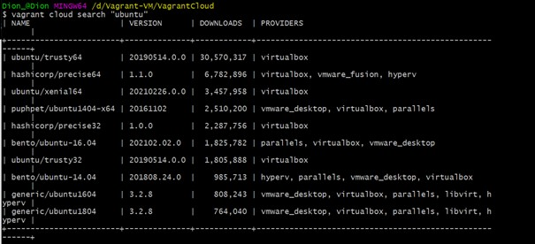
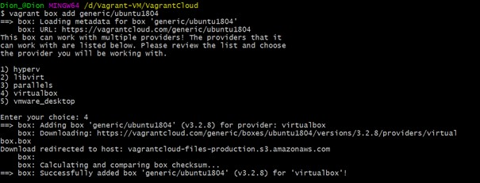
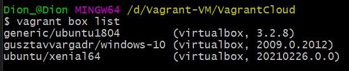
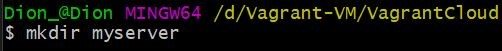
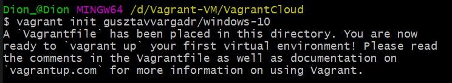
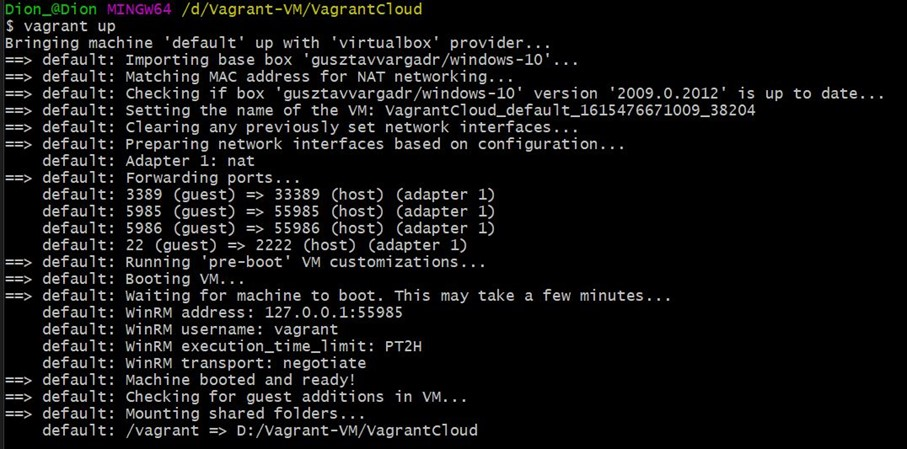
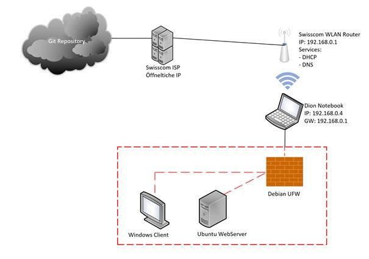
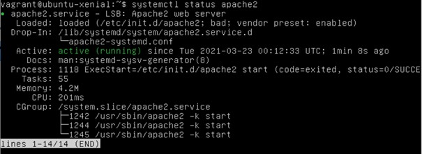
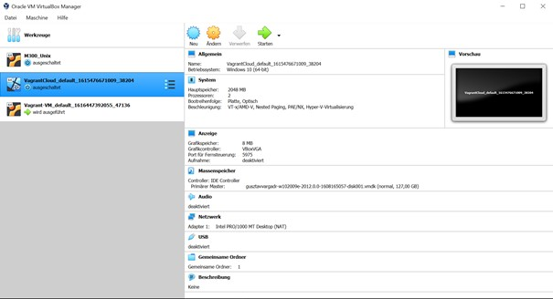
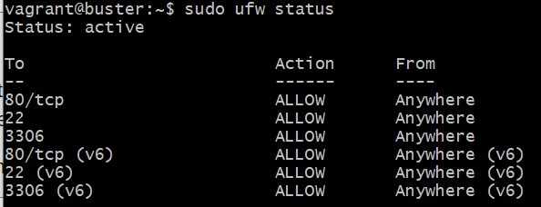

[**ZURÜCK**](../README.md)

# 20-Infrastruktur-Automatisierung

## Inhaltsverzeichnis

* 01 - [Vagrant Cloud](#vagrant-cloud)
* 02 - [Vagrant Befehle](#vagrant-befehle)
* 03 - [Netzwerkplan](#netzwerkplan)

## Vagrant Cloud

**Vagrant VM von Cloud downloaden**

Zuerst sollte man überhaupt nach einer bestimmten Box suchen die man downloaden möchte:

Nachdem man dann gefunden hat was man möchte und auch nachgeschaut hat, ob es kompatibel ist mit der Virtualisierungslösung die man verwendet, kann man weiter gehen zum download:

Sobald der download vollendet ist kann man nochmals mit dem folgenden Befehl korrigieren ob es wirklich heruntergeladen wurde:

`vagrant box list`

(OPTIONAL)Nun kann man einen weitren Ordner erstellen indem man die VM dann erstellt:

`mkdir myserver`

Nun die neue Vagrant Umgebung (VM) ind dem Verzeichnis erstellen:

`vagrant init "Name der Box"`

Zu guter Letzt kann man die VM starten:

 `vagrant up`

 

 ## Vagrant Befehle

 [**Nach oben**](#20-infrastruktur-automatisierung)

 Die am häufigsten gebrauchten Befehle sind hier aufgelistet, da man Vagrant hauptsächlich im CLI verwendet.

| Vagrant Befehl            | Beschreibung/Nutzen                                               |
| ------------------------- | ----------------------------------------------------------------- |
| `vagrant version`         | Zeigt die Vagrant-Versionsinformationen                           |
| `vagrant up`              | Erzeugt die Vagrant-Umgebung                                      |
| `vagrant suspend`         | Anhalten einer laufenden Vagrant-Umgebung                         |
| `vagrant status`          | Zeigt den Status der aktuellen Vagrant-Umgebung an                |
| `vagrant ssh_config`      | gibt .ssh/config gültige Syntax für die Verbindung zu dieser Umgebung über ssh aus|
| `vagrant ssh`             | SSH Verbindung zur aktuellen Vagrant-Umgebung                     |
| `vagrant resume`          | Fortsetzen einer angehaltenen Vagrant-Umgebung                    |
| `vagrant reload`          | Laden Sie die Umgebung neu, halten Sie sie an und starten Sie sie neu|
| `vagrant provision`       | Wiederholen Sie das Bereitstellungsskript auf einer laufenden VM  |
| `vagrant package`         | Paketieren Sie eine Vagrant-Umgebung für die Verteilung           |
| `vagrant init [box_name] [box_url]` | Initialisieren des aktuellen Ordners für die Verwendung mit Vagrant|
| `vagrant help [TASK]`     | Beschreiben Sie verfügbare Tasks oder eine bestimmte Aufgabe      |
| `vagrant halt`            | Halten Sie die laufenden VMs in der Umgebung an                   |
| `vagrant destroy`         | Zerstört die Umgebung, indem Sie die erstellten virtuellen Maschinen löschen|
| `vagrant box`             | Zeigt die Befehle zur Verwaltung von Systemboxen an               |

Weitere Befehle und Hilfe zu Vagrant: https://www.vagrantup.com/docs/cli/

## Netzwerkplan

 [**Nach oben**](#20-infrastruktur-automatisierung)

Dies ist die aktuelle Lage meines Netzwerkes inklussive den VM's auf einem Netzwerkplan:

 

## Testing

 [**Nach oben**](#20-infrastruktur-automatisierung)

### Apache2 Installation

Zuerst testen wir ob auch das bearbeitete Vagrant file, "Apache2" mit installiert hat.
Da diese VM nur CLI hat kann man das mit folgendem Befehl testen:

 

### Installierte Windows Client VM

Hier wird geschaut ob der Windows Server via Cloud installiert wurde:

 

### UFW Aktiv?

Hier wurde kontrolliert ob die UFW aktiv ist und welche Regeln schon drauf sind:

 
 