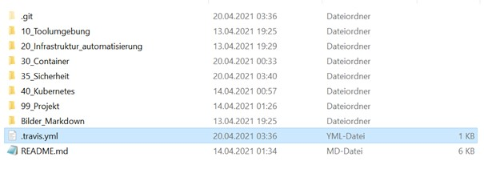

[**ZURÜCK**](../README.md)

## 35-Sicherheit

## Inhaltsverzeichnis 
* 01 - [Protokollieren & Überwachen](#protokollieren--überwachen)
* 02 - [Container sichern & beschränken](#container-sichern--beschränken)
* 03 - [Kontinuierliche Integration](#kontinuierliche-integration)
* 04 - [Beispiele](#beispiele)

## Protokollieren & Überwachen
[**Nach oben**](#35-sicherheit)

Das Protokollieren und Überwachen gehört heut zu tage zu den wichtigsten Punkten eines Systems.
Anhand davon ist ein effektiveres debuggen möglich, sowie wenn man ein nichttriviales System am Laufen halten will.

Beispiele für Logging wären:

* json-file
  * Standard-Logging
* syslog
  * Syslog-Treiber der Hosts
* none
  * keine Protokollierung

## Container sichern & beschränken
[**Nach oben**](#35-sicherheit)

### Mögliche Probleme mit Container
[**Nach oben**](#35-sicherheit)

* Kernel Exploits
  * Dies beschreibt die Situation wenn ein Host runter geht aufgrund einer Kernel Panic, da ja alle Container den Kernel gemeinsam verwenden.
* DoS-Attacke
  * Hiermit ist gemeint wenn bestimmte User nicht mehr Teile des Systems ansprechen können. Da diese Überfordert sind z.B mit einer Menge von Anfragen.
* Container-Breakouts
  * Damit ist gemeint, wenn jemand Zugriff auf einen Container bekommt, dass er im besten Fall nicht in der Lage sein sollte um anschliessend auf andere Container zu kommen.
* Vergiftete Images
  * Es kann auch manipulierte Images geben...immer auf aktuelle Versionen prüfen.
* Verratene Geheimnisse
  * Wenn ein User zum Beispiel die Zugriffsdaten auf einen wichtigen Server vergibt.

### Least Privilege
[**Nach oben**](#35-sicherheit)

Hierbei geht es darum, dass jeder Prozess und jeder Container nur mit den nötigsten Zugriffen und Ressourcen welche er gerade braucht. Im Falle von einem Angriff könnte der Angreiffer nicht viel anfangen aufgrund der Berechtigungen.

### Container absichern
[**Nach oben**](#35-sicherheit)

Wichtigste Punkte für die Absicherung:

* Aktuellste Software
* Überwachung/Monitoring
* Images
  * Benutzer definieren...nicht direkt via root
  * via einem Hash-Wert herunterladen
* dedizierter Host
* Netzwerk
  * Nur nötige Ports öffnen
  * Nur Intern für andere Container erreichbar
* Binaries entfernen

## Kontinuierliche Integration
[**Nach oben**](#35-sicherheit)

Dies beschreibt das fortlaufende Zusammenfügen von Komponenten zu einer Andwendung. Hierbei geht es Hauptsätzlich um die Steigung der Softwarequaität.

Grundsätze:

* Gemeinsame Codebasis
* Automatisierte Übersetzung
* Kontinuierliche Test-Entwicklung
* Häufige-Integration
* Kurze Testzyklen
* Redundanz
* Automatisiertes Reporting

## Beispiele
[**Nach oben**](#35-sicherheit)

### Travis Ci / Continious Integration

Auf folgenden Link: `https://travis-ci.com/`

Nun auf Sign up > mit Github Konto einloggen > Authorize Travis CI

Nun muss man wie im folgenden Screenshot, auf die grüne Schaltfläche, wo "Activate" drauf steht drücken:


Jetzt kann man noch auswählen welches Repository davon betroffen ist:


Nun muss man im Repository ein File erstellen und dies folgendermassen beschriften:



In diesem File kann man dann jeweils die Builds machen...kleines Beispiel:

```Shell
language: node_js
node_js:
 - "node"
```

Nun muss man noch zwei3 weitere Files erstellen, die wir für dieses Beispiel brauchen:

## hello.js

Der Inhalt dieser Datei muss folgendermassen aussehen:

```Shell
var http = require('http');
http.createServer(function (req, res) {
  res.writeHead(200, {'Content-Type': 'text/plain'});
  res.end('Hello Travis!\n'); // build should pass now!
}).listen(1337, '127.0.0.1');
console.log('Server running at http://127.0.0.1:1337/');
```

## package.json

Und in diesem JSON File braucht es noch folgenden Inhalt:

```Shell
{
    "name": "learn-travis-YOURNAME",
    "description": "Simple Travis-CI check for JSHint (Code Linting)",
    "author": "your name here :-)",
    "version": "0.0.1",
    "devDependencies": {
      "jshint": "^2.6.0"
    },
    "scripts": {
      "test": "jshint hello.js"
    }
  }
```

Im WebGUI kann man dann sehen ob der Build erfolgreich war oder nicht...die ersten paar tests waren nicht erfolgreich, da ich dort einen anderen Build probiert habe.
Nichts desto trotz sollte es folgendermassen aussehen:


## Monitoring mit cAdvisor

Der cAdvisor ermöglicht es den Containernutzern ein Verständnis der Ressourcennutzung und der Leistungsmerkmale ihrer laufenden Container. cAdvisor ist ein laufender Daemon, welcher Informationen über die Auslastung der Container sammelt, diese verarbeitet und am Schluss wieder ausgibt.

Installieren kann man das ganze mit dem folgenden Befehl:


Und dies kann danach so aussehen:

