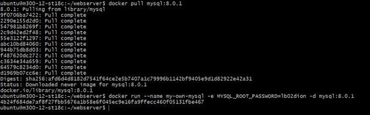

[**ZURÜCK**](../README.md)

## 99-Projekt

## Inhaltsverzeichnis 
* 01 - [Übersicht](#übersicht)
* 02 - [Netzwerkplan](#netzwerkplan)
* 03 - [Container](#container)
* 04 - [Testing](Testing)

## Übersicht
[**Nach oben**](#99-projekt)

In meinem Projekt habe ich eine Docker Umgebung erstellt mit 2 Docker Container. 
Diese zwei Container sollten zusammen agieren, nämlich habe ich einmal einen MySQL-Server und dann noch einen phpmyadmin Container.

## Netzwerkplan
[**Nach oben**](#99-projekt)


## Images
[**Nach oben**](#99-projekt)

In diesem Projekt habe ich es mir etwas einfacher gemacht, indem ich die Images vom Docker-Hub heruntergeladen habe:

```Shell
docker pull mysql:8.0.1
```

```Shell
docker pull phpmyadmin/phpmyadmin:latest
```


## Container
[**Nach oben**](#99-projekt)

Anschliessend habe ich mit dem folgendem Befehl noch die Container erstellt:

```Shell
docker run --name my-own-mysql -e MYSQL_ROOT_PASSWORD=mypass123 -d mysql:8.0.1
```

```Shell
docker run --name my-own-phpmyadmin -d --link my-own-mysql:db -p 8009:80 phpmyadmin/phpmyadmin
```

Folgend sieht man noch ein Beispiel mit dem MySQL Server wo beide Befehle ausgeführt werden:



## Testing
[**Nach oben**](#99-projekt)

Der erste Test war ob man überhaupt auf die "phpmyadmin" Seite kommt:


Nun zu guter letzt habe ich auch noch getestet ob ich mich überhaupt einloggen kann:


